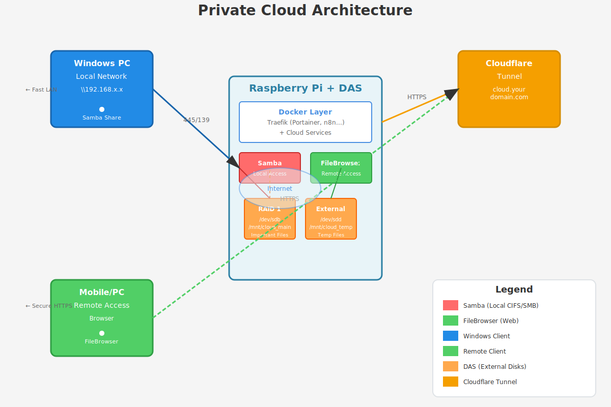

# 🌐 Private Cloud Solution - Samba + FileBrowser

A complete guide for setting up a private cloud storage solution on Raspberry Pi using Samba for local network access and FileBrowser for remote web access.

## 🏗️ Architecture



*Diagram showing Raspberry Pi with DAS (Direct Attached Storage) configuration, Samba for local access, FileBrowser for remote access via Cloudflare Tunnel*


## 🎯 What This Does

This solution provides:
- **Local fast access** via Samba (CIFS/SMB) for Windows machines
- **Remote secure access** via FileBrowser through Cloudflare Tunnel
- **RAID 1 protection** for important files
- **Automatic SSL** via Traefik reverse proxy

## 📋 Features

✅ Samba local network sharing (Windows drag-and-drop)  
✅ FileBrowser web interface (remote access from anywhere)  
✅ RAID 1 disk for important files redundancy  
✅ Cloudflare Tunnel for secure remote access without open ports  
✅ Automatic SSL certificates  
✅ Firewall configuration included  

## 🚀 Quick Start

1. **Clone this repository:**
   ```bash
   git clone https://github.com/enemy100/private-cloud-raspberry.git
   cd private-cloud-raspberry
   ```

2. **Follow the setup guide:**
   - See `PRIVATE_CLOUD_SETUP.md` for complete step-by-step instructions
   - Configure your disks (RAID 1 + normal disk)
   - Add services to your existing docker-compose.yml
   - Configure Cloudflare DNS and Tunnel

3. **Enjoy your private cloud!**

## 📦 Requirements

- Raspberry Pi with Ubuntu/Raspberry Pi OS
- **DAS (Direct Attached Storage)**: Two external USB disks (one for RAID 1, one normal)
- Cloudflare account (for tunnel)
- Existing Docker and Docker Compose setup
- Traefik reverse proxy configured

## 📝 Documentation

- **[PRIVATE_CLOUD_SETUP.md](PRIVATE_CLOUD_SETUP.md)** - Complete setup guide
- **[README.md](README.md)** - This file

## 🔧 Technologies

- **Samba** - SMB/CIFS file sharing for local network
- **FileBrowser** - Web-based file manager for remote access
- **Docker** - Container orchestration
- **Traefik** - Reverse proxy
- **Cloudflare Tunnel** - Secure remote access

## 🛠️ Troubleshooting

See the [Troubleshooting section](PRIVATE_CLOUD_SETUP.md#-troubleshooting) in PRIVATE_CLOUD_SETUP.md for common issues and solutions.

## 📄 License

MIT License - feel free to use and modify as needed.

## 👤 Author

Created as part of the private cloud infrastructure setup on Raspberry Pi.

